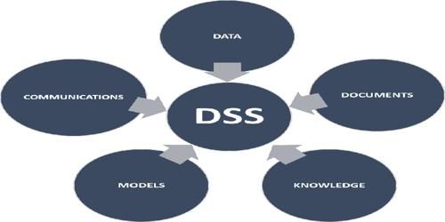

# Decision-Support-System

In India, the ratio of oncologist to patients is 1: 2000. To overcome this situation, in order to support the oncologist we created a **Decision Support System**. Which, will assist the oncologist in order to diagnose the intensity of breast cancer we built a model that connects natural language processing (NLP) with machine learning algorithms. The mammography reports obtained were of text forms so we used NLP to extract the information as input to the model we built. We used some of the machine learning algorithms available to build the model. The robustness of the model build was tested using receiver operating characteristic (ROC) curve.
